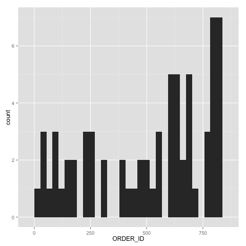

#Project 1

### **Obtaining The Dataframes**

The dataframes were obtained from an oracle database on RestfulRel server. The code that handles dataframe creation can be found in 01 Data folder. In order to visualize the data in the next step, the user must run all 5 R files in that folder to generate the necessary dataframes.
The dataframes are of the following (head is used to save space):

**Customer Dataframe**

```{r}
source("../01_Data/Dataframe_C.R", echo=TRUE)
```

**Item Dataframe**

```{r}
source("../01_Data/Dataframe_I.R", echo=TRUE)
```

**Order Dataframe**

```{r}
source("../01_Data/Dataframe_O.R", echo=TRUE)
```

**Order Detail Dataframe**

```{r}
source("../01_Data/Dataframe_D.R", echo=TRUE)
```

### **Visualizing The Data**

After obtaining the dataframes from 01 Data folder, go into 02 Visualization folder and run Plot.R. This file will generate 7 plots; 4 of which are for each of the dataframes shown above and the last 3 for analysis of the overall data.

**Customer Plot**


This plot shows the number of customer that reside in each state (that has at least one customer). A great majority of the customers are living in California. The graph could provide insight regarding marketting and expanding customer base.

**Item Plot**


This plot shows the price of each item being sold. 

**Order Plot**


This plot shows the number of orders for each customer. There are a few customers that had not ordered anything. Reaching out to those people could increase or improve business.

**Order Detail Plot**



This plot shows the number of items sold for each order. As time passes, the number of items per order seem to be increasing.

**Reproduction Plots**


